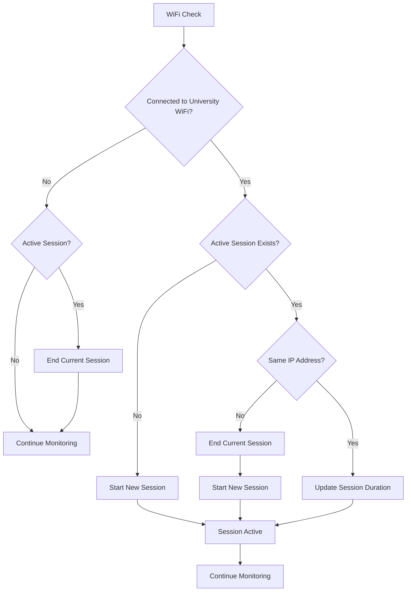

# Session Transition Behavior

This document explains how the UniTree app handles WiFi session transitions when users move between networks or IP addresses change.

## 🔄 Session Transition Scenarios

### 1. **IP Address Change** (Same University Network)
When connected to the same university WiFi but IP address changes:

**Background Service:**
```typescript
// Detected in performBackgroundWifiCheck()
if (currentSession.ipAddress !== ipAddress) {
  console.log('📶 IP address changed, ending previous session and starting new one');
  await this.endCurrentBackgroundSession();
  await this.startBackgroundSession(ipAddress);
}
```

**Foreground Service:**
```typescript
// Detected in handleNetInfo()
if (this.currentIPAddress !== ipAddress) {
  console.log('📶 IP address changed in foreground, ending previous session and starting new one');
  await this.endSession();
  await this.startSession(ipAddress);
}
```

### 2. **Network Change** (University to Non-University)
When switching from university WiFi to another network:

```typescript
if (!this.isUniversityIP(ipAddress)) {
  console.log('❌ Not on university WiFi, ending session');
  await this.endCurrentBackgroundSession();
}
```

### 3. **WiFi Disconnection**
When WiFi is completely disconnected:

```typescript
if (currentSession?.isActive) {
  console.log('📵 WiFi disconnected, ending session');
  await this.endCurrentBackgroundSession();
}
```

### 4. **Network Reconnection**
When reconnecting to university WiFi:

```typescript
if (!currentSession || !currentSession.isActive) {
  // No active session, start a new one
  await this.startBackgroundSession(ipAddress);
}
```

### 5. **App Reopen After Force Close**
When the app is completely closed and reopened:

```typescript
// In handleAppReopen()
const currentSession = await this.getCurrentSession();
if (currentSession?.isActive) {
  // End any previous session that was still marked as active
  await this.endCurrentBackgroundSession();
}

// Check current WiFi and start new session if appropriate
const netInfo = await NetInfo.fetch();
if (netInfo.type === 'wifi' && this.isUniversityIP(ipAddress)) {
  await this.startBackgroundSession(ipAddress);
}
```

This ensures proper session boundaries even when the app is force-closed.

## 🎯 Improved Session Management

### Before Enhancement:
- ❌ Could have overlapping sessions
- ❌ IP address changes ignored
- ❌ Potential data inconsistencies
- ❌ Poor session boundary tracking

### After Enhancement:
- ✅ **Clean session boundaries**
- ✅ **Automatic session transitions**
- ✅ **IP address change detection**
- ✅ **Comprehensive logging**
- ✅ **Data integrity maintained**

## 📊 Session Lifecycle Flow



## 🔧 Technical Implementation

### Session State Management:
```typescript
interface BackgroundSession {
  id: string;           // Unique session identifier
  startTime: string;    // ISO timestamp when session started
  endTime?: string;     // ISO timestamp when session ended
  ipAddress: string;    // IP address for this session
  duration: number;     // Duration in seconds
  isActive: boolean;    // Whether session is currently active
  timestamp: string;    // Last update timestamp
}
```

### Session Transition Detection:
```typescript
// Background WiFi Check Logic
const currentSession = await this.getCurrentSession();
const ipAddress = wifiDetails.ipAddress;

if (this.isUniversityIP(ipAddress)) {
  if (!currentSession || !currentSession.isActive) {
    // No active session - start new one
    await this.startBackgroundSession(ipAddress);
  } else if (currentSession.ipAddress !== ipAddress) {
    // IP changed - transition sessions
    await this.endCurrentBackgroundSession();
    await this.startBackgroundSession(ipAddress);
  } else {
    // Same session - update duration
    await this.updateBackgroundSession();
  }
}
```

### Server-Side Session Handling:
```javascript
// Check for existing active sessions
let activeSession = await WifiSession.findOne({
  user: req.user._id,
  isActive: true,
  endTime: null,
});

if (activeSession && activeSession.ipAddress !== ipAddress) {
  // End previous session and start new one
  logger.info(`Ending previous session and starting new one. Old IP: ${activeSession.ipAddress}, New IP: ${ipAddress}`);
  
  // End the previous session with points calculation
  await endActiveSession(activeSession);
  
  // Start new session
  activeSession = await createNewSession(ipAddress);
}
```

## 📝 Enhanced Logging

### Session Start:
```
🔄 Background session started: bg_1234567890_abc123 on IP: 192.168.1.100
```

### Session Transition:
```
📶 IP address changed, ending previous session and starting new one
⏹️ Background session ended: bg_1234567890_abc123 Duration: 15m 30s IP: 192.168.1.100
🔄 Background session started: bg_1234567890_def456 on IP: 192.168.1.101
```

### Session End:
```
❌ Not on university WiFi, ending session
⏹️ Background session ended: bg_1234567890_def456 Duration: 25m 45s IP: 192.168.1.101
```

### No Active Session:
```
⚠️ No active session to end
```

## 🎯 Benefits of Enhanced Session Management

### 1. **Data Accuracy**
- Each session represents a single, continuous connection
- No overlapping or duplicate sessions
- Accurate duration tracking

### 2. **User Experience**
- Seamless transitions between networks
- No lost tracking time
- Consistent point attribution

### 3. **System Reliability**
- Robust error handling
- Comprehensive logging for debugging
- Predictable behavior across scenarios

### 4. **Performance**
- Efficient session state management
- Minimal resource usage during transitions
- Quick detection of network changes

## 🚨 Edge Cases Handled

### 1. **Rapid Network Switching**
- Prevents session creation storms
- Ensures clean session boundaries
- Maintains data consistency

### 2. **IP Address Flickering**
- Stable session management
- Prevents unnecessary session churn
- Maintains user experience

### 3. **Network Interruptions**
- Graceful session termination
- Data preservation during outages
- Automatic resumption on reconnection

### 4. **App State Changes**
- Consistent behavior across foreground/background
- Synchronized session management
- Unified logging and tracking

## 📊 Session Metrics Tracked

### Per Session:
- **Start Time**: When session began
- **End Time**: When session ended
- **Duration**: Total connection time
- **IP Address**: Network identifier
- **Points Earned**: Based on duration
- **Source**: Background or foreground

### Aggregate:
- **Daily Sessions**: Count and total time
- **Session Transitions**: Number of IP changes
- **Average Session Duration**: Time per session
- **Network Coverage**: Different IPs used

## 🔍 Troubleshooting Session Issues

### Common Problems:

**Multiple Active Sessions:**
- ✅ **Fixed**: Automatic detection and cleanup
- ✅ **Prevention**: IP address comparison

**Missing Session Data:**
- ✅ **Fixed**: Robust session persistence
- ✅ **Recovery**: Automatic sync on app open

**Incorrect Duration:**
- ✅ **Fixed**: Precise timestamp tracking
- ✅ **Validation**: Server-side verification

**Lost Transitions:**
- ✅ **Fixed**: Enhanced transition detection
- ✅ **Logging**: Comprehensive audit trail

---

**Result**: The enhanced session transition behavior ensures accurate, reliable WiFi session tracking with seamless transitions between networks and IP addresses. 